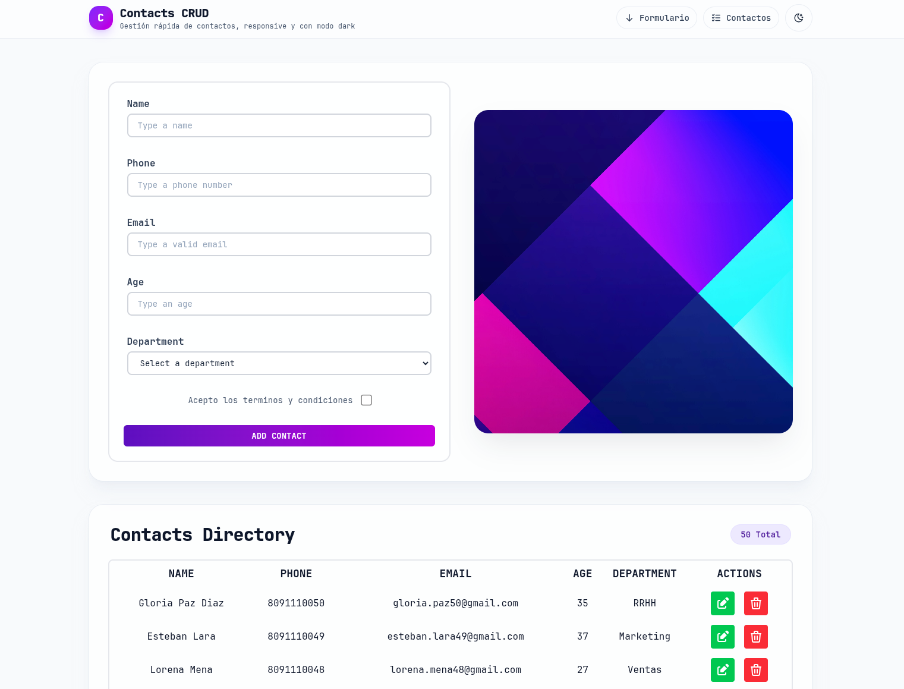

# Contacts CRUD — mini proyecto React

Ejercicio pequeño en **React** con **Vite** y **Tailwind CSS**: formulario para crear contactos, tabla con edición y borrado, modo claro/oscuro y diseño responsive.



## Qué incluye

- Formulario de alta (nombre, teléfono, email, edad, departamento, términos).
- Listado en tabla con acciones de editar y eliminar.
- Tema **dark** con persistencia en `localStorage`.
- UI con Tailwind (tarjetas, header fijo, footer con accesos rápidos).

## Requisitos

- Node.js (recomendado LTS).
- API REST en `http://localhost:5000/users` (JSON Server u otro backend compatible) para que el listado y el CRUD funcionen.

## Cómo ejecutarlo

El backend corre con **JSON Server** en `http://localhost:5000/users`. Primero levantamos la API y luego el frontend:

```bash
# Terminal 1 — API REST
npm run server

# Terminal 2 — Frontend
npm run dev
```

El proyecto ya incluye datos de ejemplo en `src/api/db.json`.

Otros scripts: `npm run build`, `npm run preview`, `npm run lint`.

## Estructura relevante

- `src/App.jsx` — layout, tema y scroll a secciones.
- `src/components/Main.jsx` — datos HTTP y secciones principal/tabla.
- `src/components/Form.jsx`, `Table.jsx` — formulario y tabla.
- `src/helpers/helpHttp.js` — peticiones HTTP.

---

Proyecto de práctica; no está pensado como producción lista para desplegar sin revisar seguridad, validación y configuración del backend.
